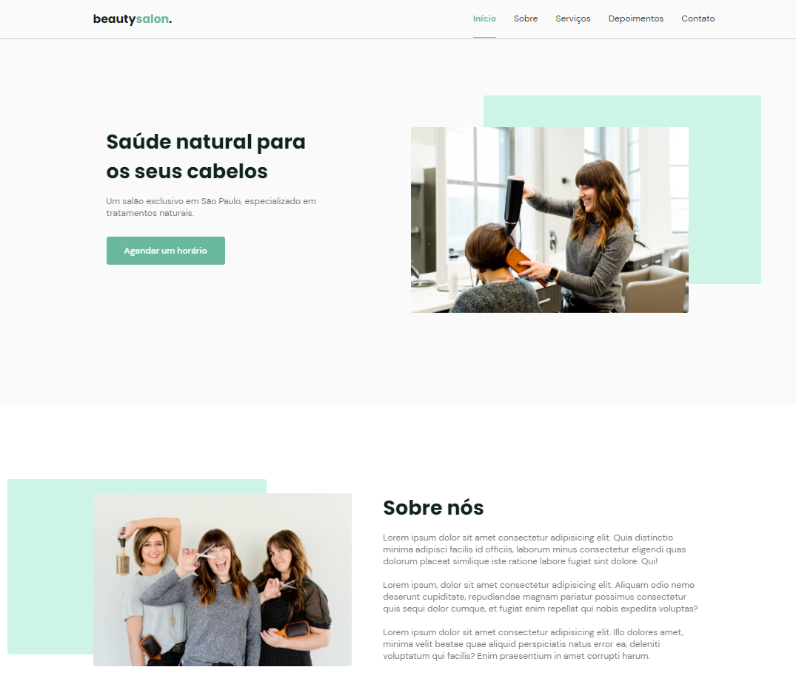

<h2 align="center">
  Beaut Saloon
</h2>
<h3 align="center">
  Desenvolvido com Rocketseat em Next Level Week 6.0
</h3>

  

  

## 🚀 Tecnologias

Esse projeto foi desenvolvido com as seguintes tecnologias:

* HTML
* CSS
* JavaScript

Bibliotecas:

* Google Fonts
* SwipeJS
* ScrollRevel

Utilitários:

* randomuser.me
* IconMoon

## 💻 Projeto
OriginSix é uma página responsiva no formato One Page, elaborada no Figma. Projeto desenvolvido com a Rocketseat, aulas com o professor  Mayk Brito.

## 🔖 Layout
Você pode visualizar o layout do projeto através desse link https://yan-gelsleichter.github.io/Beaut-Saloon/

Feito com ♥ by Yan-Gelsleichter👋
